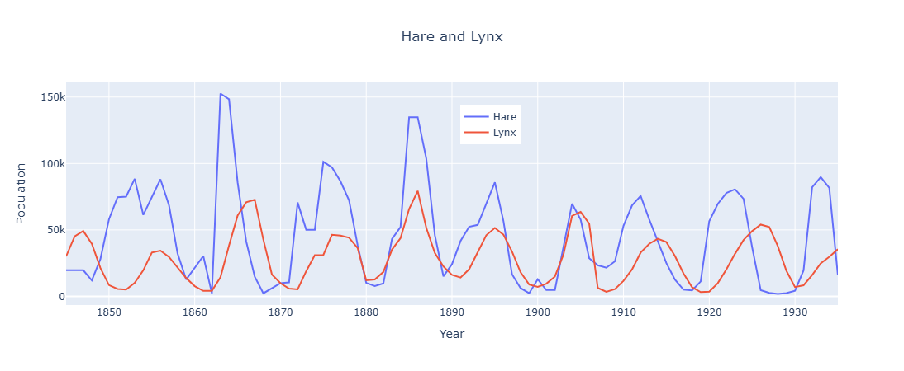
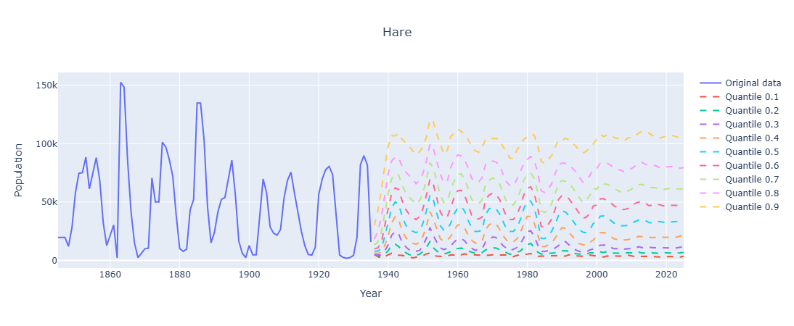
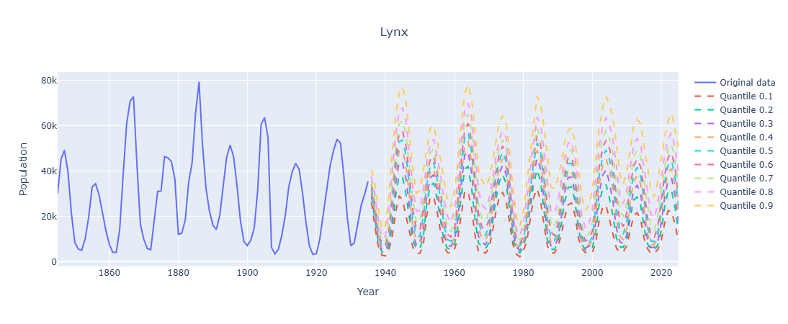
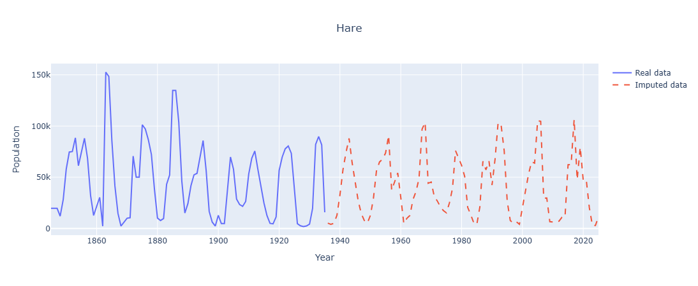
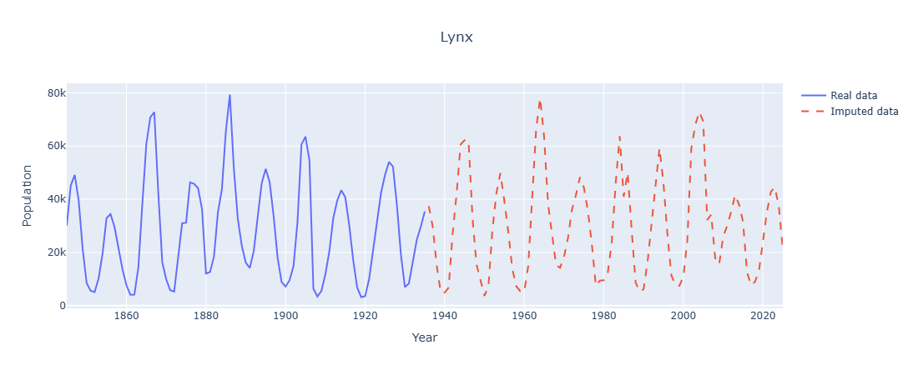

# LotkaVolterraSyntheticData

Extending historical predator-prey data with Chronos2 forecasting.

## What's This About?

I had real Hudson's Bay Company fur trading records showing Hare and Lynx populations from 1845-1935. To create a longer dataset for analysis, I used Amazon's Chronos2 model to generate synthetic population data extending through 2025.

## Background

The classic Lotka-Volterra equations describe predator-prey dynamics - those cyclical population patterns where predator and prey numbers oscillate over time. The Canadian Lynx and Snowshoe Hare populations are one of the most famous real-world examples of this.

## How It Works

1. Start with real data from 1845-1935
2. Use Chronos2 to forecast future populations
3. The model generates predictions at different quantile levels (0.1 through 0.9)
4. Manually select quantiles for each year to create realistic trajectories
5. Combine real and synthetic data into one dataset spanning 1845-2025

## Results


*Both species showing the classic predator-prey cycle*


*Hare population: real data until 1935, then Chronos2 predictions with different quantiles*


*Lynx population: real data until 1935, then Chronos2 predictions with different quantiles*


*Complete data for Hare - real until 1935 and synthethic onwards*


*Complete data for Lynx - real until 1935 and synthethic onwards*

The synthetic data maintains the oscillatory behavior you'd expect - lynx populations still lag behind hare populations like they should.

## Repository Structure

```
.
├── data/
│   ├── lotka_volterra_data.csv          # Original data (1845-1935)
│   ├── full_lodka_voltera_data.csv      # Complete dataset (1845-2025)
│   ├── after_chronos_hare.csv           # Chronos2 predictions for Hare
│   ├── after_chronos_lynx.csv           # Chronos2 predictions for Lynx
│   ├── chosen_quantiles_hare.csv        # Selected quantiles for Hare
│   └── chosen_quantiles_lynx.csv        # Selected quantiles for Lynx
├── pictures/                            # Plots
├── main.py                              # Main script
└── README.md
```

## Usage

### Setup

```
uv sync
```

### Run

```
uv run main.py
```
